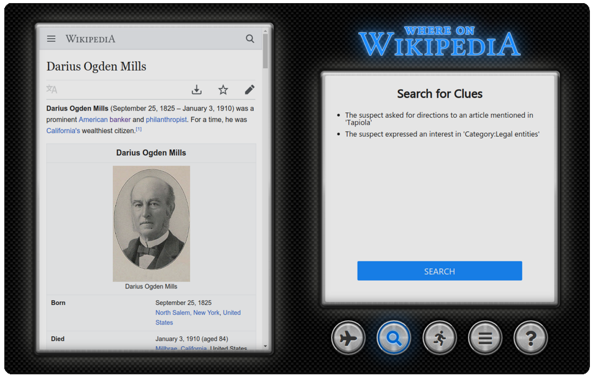

# Where on Wikipedia

As our final project for the [Lighthouse Labs](https://www.lighthouselabs.ca) web development bootcamp, we chose to recreate the classic Carmen Sandiego games - where they came with a desk encyclopedia or almanac, however, we've decided to make use of a slightly more modern source.

## Usage

### The Easy Way
-placeholder-

### The Hard Way

- Install MongoDB. I won't even try to offer instructions on how to do that.
- Clone this repository
- Using `.env.example` as a guide, create a `.env` file in the project's root directory. Change appropriate variables to match
- `npm install`
- `npm run seed` to create the database and example game.
- `npm start`
- Direct your browser to [http://localhost:3000](http://localhost:3000), replacing the port (3000 here) with whatever you have the server running on.

## Dependencies

- Node.js
- Express
- MongoDB

## Contributors

Where on Wikipedia was developed by [Adam Lovatt](https://github.com/jalovatt/) and [Bryan Kenny](https://github.com/bryankenny).

## Future Ideas

We had to leave out some planned features due to time constraints:

- A wider variety of clues, both in terms of the messages given and the type of article information clues are generated from.
- Difficulty scaling, whether by the number of steps in a game or somehow assessing how hard a given set of clues/destinations might be.
- Tracking the games a player has started, won, and lost. The server and database have a decent amount of code in place for this already.
- Provide a unique game ID so players can share a particular mystery with friends. The app already uses these IDs internally, so we're really just missing a nice way to convey it to the player.
- Integrate the app with the embedded Wikipedia page. [The Wiki Game](https://www.thewikigame.com) does this by rewriting the Wikipedia HTML so that all clicked links go through their app.

Contributions are more than welcome. :)

## Attributions

- The glass overlay effect was adapted from an article on [dev.opera.com](https://dev.opera.com/articles/beautiful-ui-styling-with-css3/#glassbox).
- The brushed metal and glowing button effects were adapted from [this Codepen](https://codepen.io/simurai/pen/DwJdq).
- The background texture was found on [Stack Overflow](https://stackoverflow.com/a/34556311/9667199).
